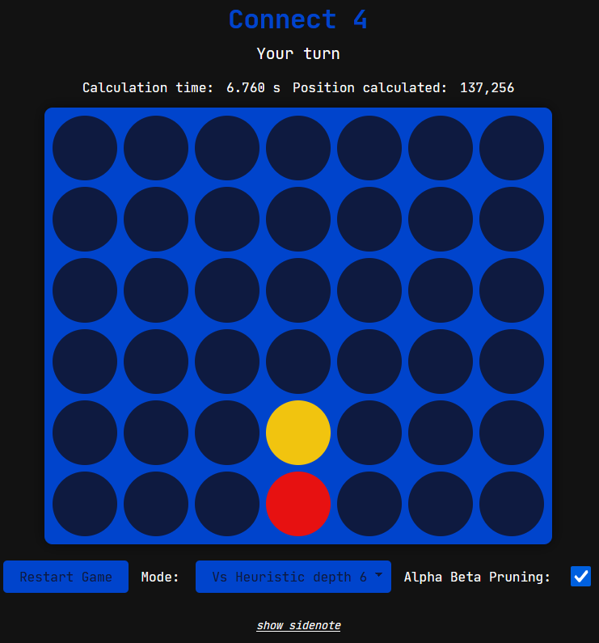
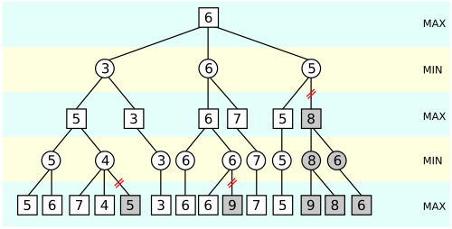

# WEB CONNECT4




A modern web-based **Connect 4** built with **Vanilla JavaScript**, **HTML**, and **CSS**, featuring multiple AI opponents powered by a **Python Flask backend**.  
This project explores fundamental AI algorithms such as **Minimax** and **Alpha-Beta Pruning**, designed for both fun and educational demonstration purposes during my school's open day.

---

## Overview

**Web Connect4** allows players to:

- Play locally (2 players on the same device)
- Play against a **random-move algorithm**
- Challenge progressively smarter **heuristic AI agents** (depth 1 to 6)
- Visually observe how AI decisions change with increasing search depth

The backend Python server computes AI moves and communicates with the frontend through a **simple Fetch API** interface.  
This setup makes it easy to plug in new AI algorithms or modify existing ones.

---

## 🧩 Project Structure

```

web-connect4/
├── client/
│   ├── index.html          # Main interface
│   ├── style.css           # Board & UI styling
│   ├── game.js             # Game logic (board, win detection, etc.)
│   ├── renderer.js         # Rendering + DOM manipulation
│   ├── game_controller.js  # Handles user actions & AI requests
│   └── script.js           # Link JS files together
│
├── server/
│   ├── server.py           # Flask API that hosts the AI endpoint
│   ├── heuristic_agent.py  # Implementation of Minimax / Heuristic AI
│   └── ...                 # Additional AI files if needed
│
└── README.md               # You are here!

```

---

## The AI System

### Heuristic Evaluation

Each board position is evaluated using simple rules that reward:

- **Center control**
- **Two-in-a-row** and **three-in-a-row** with open ends
- **Winning positions** (+100 points)
- **Blocking opponent’s threats**

This function provides a numeric score used by the **Minimax algorithm** to choose optimal moves.

---

### Minimax Algorithm

Minimax is a **recursive search algorithm** used in two-player games like Connect 4, Chess, or Tic-Tac-Toe.  
It simulates all possible moves up to a given **depth** and assumes:

- The **AI** wants to *maximize* the score.
- The **opponent** wants to *minimize* the score.

At the end of the search, it chooses the move that guarantees the **best possible outcome** assuming perfect play.


---

### Alpha-Beta Pruning

Alpha-Beta Pruning is an optimization that **cuts off branches** of the Minimax tree that cannot influence the final decision.  
This drastically reduces computation time, allowing deeper searches with the same performance cost.



---

## Installation & Setup

### Prerequisites

- Python 3.10+
- Flask installed (`pip install flask flask-cors`)
- A modern web browser (Chrome, Firefox, Edge, etc.)

---

### 🖥️ Backend (Flask Server)

1. Navigate to the `server` folder:

    ```bash
    cd server
    ```

2. Run the Flask app:

   ```bash
   python server.py
   ```

   By default, it runs on **[http://127.0.0.1:8000](http://127.0.0.1:8000)**

---

### 🌐 Frontend (Web Client)

1. Open the `client/index.html` file directly in your browser
   *(or serve it with a lightweight server such as VSCode Live Server).*

2. You should now see the Connect 4 interface, allowing you to:

   * Play locally
   * Play vs Random AI
   * Play vs Heuristic AI (depth 1 → 5)

---

## Technical Notes

* The frontend communicates with the Flask backend via `fetch()` POST requests:

  ```js
  const response = await fetch("http://127.0.0.1:8000/api/heuristic", {
      method: "POST",
      headers: { "Content-Type": "application/json" },
      body: JSON.stringify({ board, valid_moves, depth }),
  });
  ```

* The backend processes the state and returns:

  ```json
  { "move": 3 }
  ```

* The heuristic depth directly impacts the AI’s reasoning level — higher depth = more foresight but slower computation.
